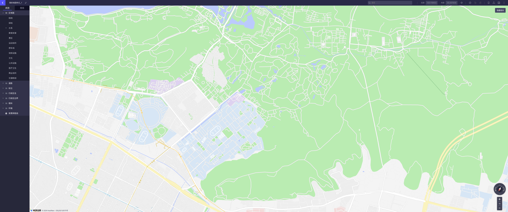
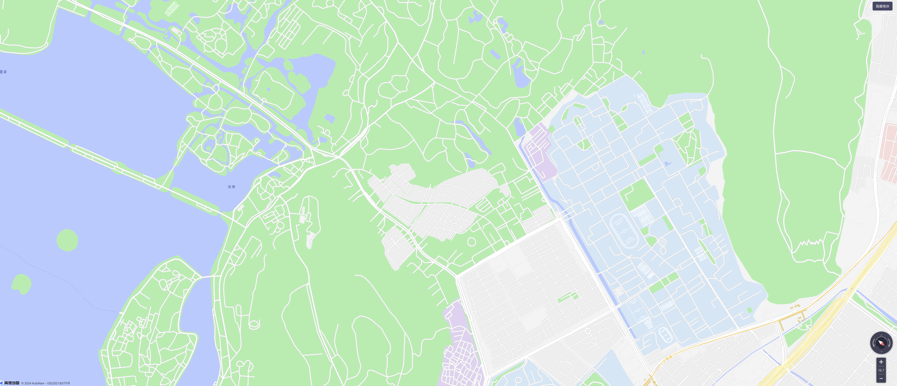
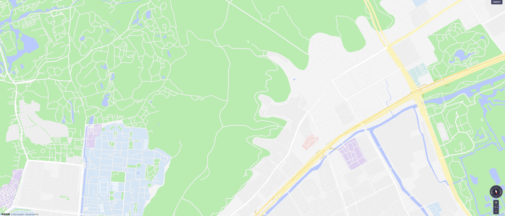
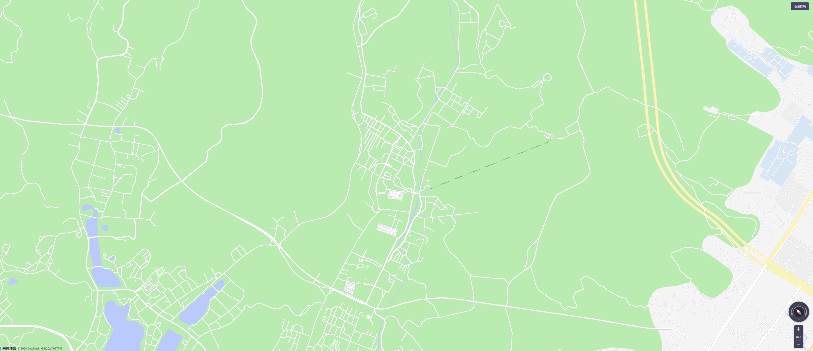

# Design

## 内容

**01 封面**

**02 专项地图**

> 参考资料：
>
> - [杭州西湖东老和云起-北高峰-东岳 2024.1.18](https://www.2bulu.com/track/t-%25252BXBJ7uKftD3p%25252FR2KBg5Tzw%25253D%25253D.htm) （全线）
> - [2024-02-24 杭州西湖区马家坞-马家坞观景平台-西山游步道-美女山-将军山-老和云起](https://www.2bulu.com/track/t-JZeAztVtiszp%25252FR2KBg5Tzw%25253D%25253D.htm)（马家坞）
> - [青芝坞-花坞，十里龙脊 看尽双西](https://www.2bulu.com/track/t-rXrtPqj4ik3p%25252FR2KBg5Tzw%25253D%25253D.htm)（青芝坞线）
> - [植物园到马家坞](https://www.2bulu.com/track/t-sDb5oU3m7Q%25252Fp%25252FR2KBg5Tzw%25253D%25253D.htm)（植物园线一）

全线A：老和云起——北高峰线

上升线：老和云起——老和山第三凉亭

灵峰线：老和山第三凉亭——灵峰植物园

北高峰线：灵峰植物园——马家坞——北高峰

**03 共创招募/共创说明——群**

**04 共创地图（白板地图）**

> 参考资料：
>
> - [高德开放平台](https://lbs.amap.com/)

**05 自我介绍/项目介绍**

**06 运营计划与安排**

## 设计细节

**01 地图美术设计**

> 参考资料
>
> - [Icons8](https://icons8.com/icons/set/trees)
> - [Iconfont](https://www.iconfont.cn/?spm=a313x.search_index.i3.d4d0a486a.674f3a811EGPhK)

山峰、机动车道路、石板路、土路、凉亭、分岔路、瞭望台

**02 合叶**

双环笔记本

**03 打印方式**

**04 封面材料**

**05 笔**

**06 文案**

（共创说明、自我介绍、项目说明）

