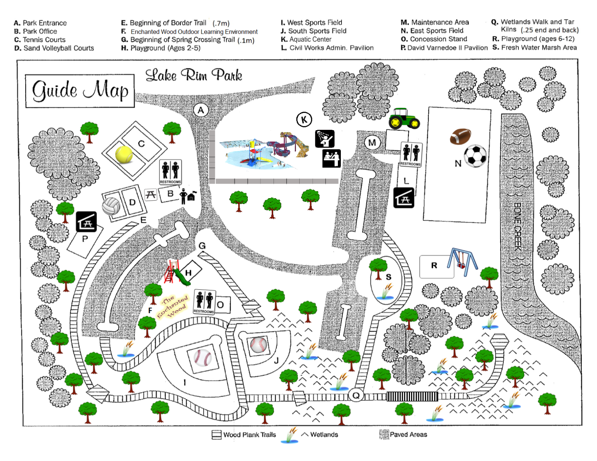

## Websites

[Fayetteville cumberland parks recreation](https://www.fcpr.us/home)（科学上网）：北卡罗来纳州 费耶特维尔坎伯兰 公园与娱乐

- [Lake Rim Park](https://www.fcpr.us/parks-trails/parks/lake-rim-park)

[走进自然可持续的春天 丨莫干春会](https://mp.weixin.qq.com/s/1Sviw4Xx1HXAa5XhD8yXGw)：实拍地图引导方法

[hangzhou_mountain](https://github.com/smasterfree/hangzhou_mountain)：2019年某人整理的杭州地图，还有一些有助于登山的数字资源

小红书：

- [2024 上海赏花地图](https://www.xiaohongshu.com/explore/65f7e75c0000000013025d47?app_platform=android&ignoreEngage=true&app_version=8.27.0&share_from_user_hidden=true&type=normal&author_share=1&xhsshare=WeixinSession&shareRedId=N0lIMEU8Rjo2NzUyOTgwNjc6OTdJNTdB&apptime=1711000114&wechatWid=812deeca1ee46b9d16e2c6a24c1a8430&wechatOrigin=menu)：重文字的大范围地图
- [西湖群山路线轨迹](https://www.xiaohongshu.com/explore/6486912c000000001303f4e2?wechatWid=812deeca1ee46b9d16e2c6a24c1a8430&wechatOrigin=noteImg)：这里有很多路线

[两步路](https://www.2bulu.com/about/contact_us.htm)：

- [老和山->北高峰->东岳](https://www.2bulu.com/track/t-i9qYg%2BSgL0np%252FR2KBg5Tzw%253D%253D.htm;jsessionid=15595B430E61AC7E909BE7C7CCB80B40-n1)

## Images

  
  
  

